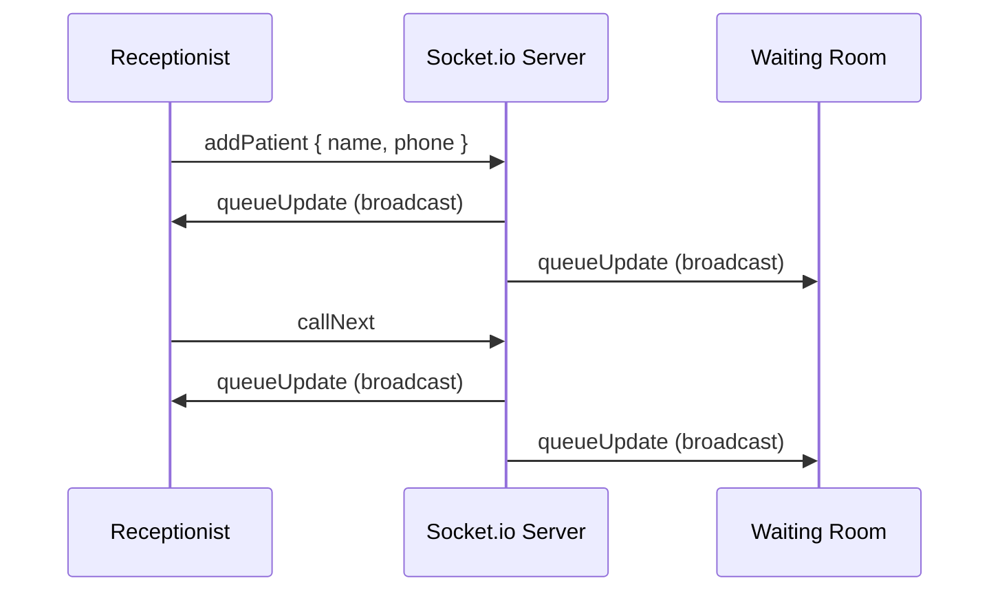

# Queue Cure '26 🩺

A real-time token queue system for Indian clinics — built for **Queue Cure
'26** on [Wooble](https://wooble.org/).

76% of India's 1.5 million clinics still run on paper token slips and
shouting across the waiting room. This replaces that with two screens that
stay in sync the instant a token is called — no refresh, no polling, no
guessing.

## Screens

**Receptionist Desk** (`/reception`)
Add a patient and issue them a token, call the next token, set the average
consultation time. Shows the full queue with live status (waiting / serving
/ done).

**Waiting Room Display** (`/patient`)
A big "Now Serving" board for the TV/tablet in the waiting room, plus a
token lookup so a patient can check how many people are ahead of them and
their estimated wait.

## How the live sync works

One Socket.io server holds the entire queue state in memory. Whenever the
receptionist adds a patient, calls next, or changes the average time, the
server broadcasts the full updated state to **every connected screen** via
a single `queueUpdate` event. Neither screen ever polls or refreshes — it's
just told the moment something changes.



A full visual diagram with every event's payload shape lives at
[`docs/socket-event-diagram.svg`](./docs/socket-event-diagram.svg).

The reasoning behind the architecture, design, and scope decisions is in
[`docs/thought-process.md`](./docs/thought-process.md).

## Tech stack

- **Client**: React + Vite + Tailwind CSS + React Router + socket.io-client
- **Server**: Node.js + Express + Socket.io
- **State**: in-memory on the server (no database — see thought process doc
  for why, and what would change that)

## Running it locally

You need two terminals — one for the server, one for the client.

**Terminal 1 — server**
```bash
cd server
npm install
npm start
```
Server runs on `http://localhost:4000`.

**Terminal 2 — client**
```bash
cd client
npm install
npm run dev
```
Client runs on `http://localhost:5173`. Open `/reception` in one tab and
`/patient` in another (or on a second device on the same network) to see
the live sync.

## Deploying it

- **Server**: any Node host works (Render, Railway, Fly.io). Free tiers are
  fine for a demo.
- **Client**: Vercel or Netlify. Set the environment variable
  `VITE_SERVER_URL` to your deployed server's URL before building, so the
  client connects to the right backend instead of `localhost`.
- Once deployed, tighten the `cors.origin` in `server/index.js` from `"*"`
  to your actual client URL.

## Project structure

```
queue-cure-26/
├── server/              # Express + Socket.io backend
│   └── index.js         # queue state + all socket events
├── client/              # React + Vite frontend
│   └── src/
│       ├── pages/
│       │   ├── Receptionist.jsx
│       │   └── PatientView.jsx
│       └── socket.js    # shared socket.io-client instance
└── docs/
    ├── socket-event-diagram.svg
    └── thought-process.md
```

## Submission checklist (Queue Cure '26)

- [ ] Working prototype link or demo video
- [x] GitHub repository with README (this one)
- [x] Socket event diagram (`docs/socket-event-diagram.svg`)
- [x] Thought process sheet (`docs/thought-process.md`)
